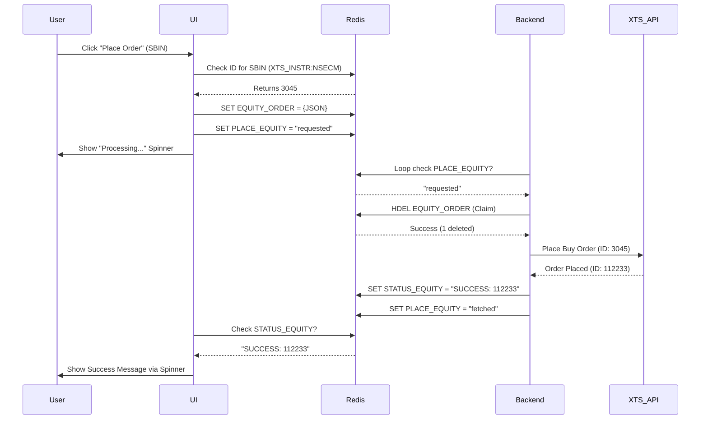

# Equity Trading Implementation - Learning Guide

This document explains **how** the Equity Trading feature was implemented, the architecture behind it, and exactly how Redis is used as the communication bridge between the UI and the Backend.

---

## 🏗️ Architecture Overview

The system follows a **Decoupled Architecture** where the User Interface (UI) and the Backend (Execution Engine) are completely separate processes. They do not talk to each other directly; instead, they communicate exclusively through **Redis**.

1.  **UI (Streamlit)**: Collects user input, validates data against Redis, and writes an "Order Request" to Redis.
2.  **Backend (Python Service)**: Listens to Redis, picks up the request, executes the order via XTS API, and reports the status back to Redis.

---

## 🧠 Redis Strategy

We use Redis for two main purposes: **Master Data Storage** and **Order State Management**.

### 1. Master Data (Instruments)
To avoid calling the XTS API every time we need to check if a symbol exists, we pre-fetch all Equity symbols and store them in Redis.

*   **Key**: `XTS_INSTR:NSECM` (Hash)
*   **Structure**: `SYMBOL -> ExchangeInstrumentID`
*   **Example**: `RELIANCE -> 2885`
*   **Why?**: Faster validation. The UI checks this key to ensure `SBIN` exists and gets its ID (`3045`) instantly without an API call.

### 2. User Order State (Communication)
Each user has a dedicated Hash in Redis (e.g., `ITC2766`). We use specific **fields** within this hash to manage the lifecycle of an equity order.

| Hash Field | Value Example | Purpose |
| :--- | :--- | :--- |
| `PLACE_EQUITY` | `requested`, `processing`, `fetched` | **The Flag**. Tells the backend "Do something!". |
| `EQUITY_ORDER` | `{"symbol": "SBIN", "qty": 1...}` | **The Payload**. Contains the actual order details. |
| `STATUS_EQUITY` | `PROCESSING`, `SUCCESS: 12345`, `FAILED: Error` | **The Feedback**. The backend writes this for the UI to read. |

---

## 🛠️ Implementation Details

### Step 1: Getting the Data (`instruments.py`)
We modified this script to fetch `NSECM` (Cash Market) instruments.
*   **Logic**: Fetch master data -> Filter for `Series == 'EQ'` -> Store in Redis `XTS_INSTR:NSECM`.
*   **Result**: Redis now knows that `TATASTEEL` is ID `3499`.

### Step 2: The User Interface (`ui.py`)
We added an "Equity" tab.
1.  **Input**: User enters `SBIN`.
2.  **Validation**: UI does `redis.hget("XTS_INSTR:NSECM", "SBIN")`. If None, it errors immediately.
3.  **Order Placement**:
    *   UI cleans up old status (`hdel EQUITY_ORDER`, `hdel STATUS_EQUITY`).
    *   UI writes the payload to `EQUITY_ORDER`.
    *   UI sets `PLACE_EQUITY` = `"requested"`.
    *   UI polls `STATUS_EQUITY` waiting for "SUCCESS" or "FAILED".

### Step 3: The Backend (`services/order_service.py`)
This is where the magic happens. The backend runs a continuous loop (`process_all`).
1.  **Listen**: It checks `hget(UID, "PLACE_EQUITY")`.
2.  **Detect Request**: If it sees `"requested"`, it knows there is work to do.
3.  **Atomic Claim (Critical!)**:
    *   It grabs the payload from `EQUITY_ORDER`.
    *   It immediately **deletes** `EQUITY_ORDER` using `hdel`.
    *   *Why?* This prevents **Double Execution**. If two backend workers try to process the loop, only one will successfully `hdel` the key. The other will get `0` deletions and abort.
4.  **Execute**:
    *   Calls XTS API `place_order` with `exchangeSegment=NSECM`.
    *   Handles `CNC` (Delivery) vs `MIS` (Intraday).
5.  **Report**:
    *   Updates `STATUS_EQUITY` to `"SUCCESS: <OrderID>"` or `"FAILED: <Reason>"`.
    *   Sends a Telegram notification.
6.  **Cleanup**: Sets `PLACE_EQUITY` = `"fetched"` to signal completion.

---

## 🔄 The Lifecycle of an Order

## ✅ Key Takeaways
1.  **Separation of Concerns**: UI only writes request; Backend only executes.
2.  **No API in UI**: The UI never talks to XTS directly for orders. Logic is safer and centralized in the backend.
3.  **Atomic Safety**: Using `hdel` as a "claim" mechanism ensures we never buy the same stock twice by accident.
